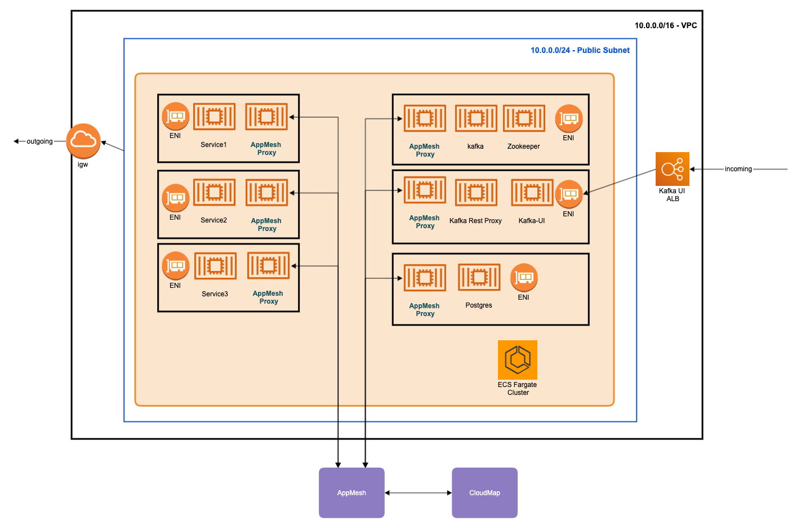

# Terraform Setup for ECS Fargate

This terraforms creates an ECS Fargate cluster with Kafka, Kafka-UI & postgres instance with AppMesh service discovery

## development

The `development` dir contains the terraform to setup a development ECS Fargate cluster with kafka, appmesh, postgres

## modules

The `modules` dir contains terraform modules for `ecr`, `iam` & `networking`

| Module | Description |
|--------|-------------|
| ECR | Creates the ECR repositories for various services|
| IAM | Creates the `ecsTaskExecutionRole` for ECS |
| Networking | Creates the VPC, subnets, security groups |
| service | Deploys an ECS Service, public-facing load balancer, routing group & updates security group with service-specific rule |
| proxied_service | Deploys an internal ECS Service with AppMesh proxy, CloudMap service & updates security group with service-specific rule |
| internal_service | Deploys an internal ECS Service & updates security group with service-specific rule |
